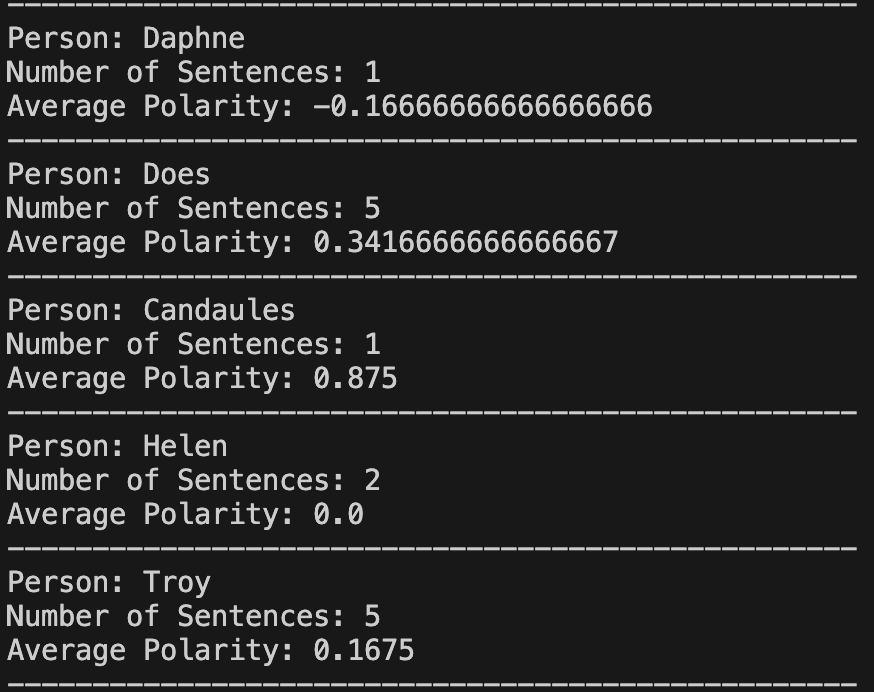

# Sentiment Analysis of Named Entities in Text

This Python script performs sentiment analysis on sentences associated with named entities (specifically, persons) extracted from a given text (url by default but can be used with local files). It uses natural language processing (NLP) techniques to identify named entities, associate them with sentences, and calculate the average sentiment polarity for each entity.

## Features

- Retrieves text data from a URL.
- Tokenizes the text into words and identifies named entities using NLTK.
- Associates sentences with named entities labeled as `PERSON`.
- Performs sentiment analysis on sentences using TextBlob.
- Calculates and displays the average sentiment polarity for each named entity.

## Sample Output



## Requirements

The script requires the following Python libraries:

- `requests` - For fetching text data from a URL.
- `beautifulsoup4` - For parsing HTML content.
- `nltk` - For tokenization, part-of-speech tagging, and named entity recognition.
- `textblob` - For sentiment analysis.
- `collections` - For managing named entity sentence associations.

You can install the required libraries using pip:

```sh
pip install requests beautifulsoup4 nltk textblob

